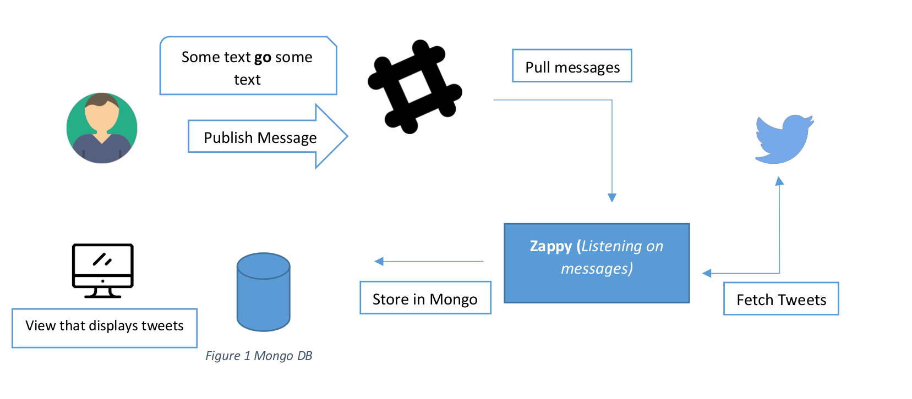

# zappy

### Zappy integrates with a Slack bot and listens on specific messages. For simplicity, we the tool will listen on all messages containing the word “go”. places a messages on a bot containing the message “go”, the tool fetches twitter feeds from the specific account and saves in a mongo collection. the view that fetches tweets from mongoDB and shows in a table.

# Diagram below visualizes the process.




# get secrets from twitter:
https://developer.twitter.com/en/apps

# create your bot and get the token :
https://api.slack.com/apps

# add your tokens of bot and secrets of twitter (IMPORTANT) :
```
cd tweets_service
echo "slack bot token" > SLACK_BOT_TOKEN.txt
echo "consumer_key twitter" > consumer_key.txt
echo "consumer_secret twitter" > consumer_secret.txt
echo "access_key twitter" > access_key.txt
echo "access_secret twitter" > access_secret.txt
```
# how to run in development mode:
 ```
 cd zappy
 bash start.sh
 ```

# How to run using docker 
## To run the full system just use docker-compose:

``` 
cd zappy
docker-compose up 
```

### check the tweets at 
``` http://localhost:4200/```

## This App is composed of three main components

* **bot service:**

    A service is responsible for:

        1- Receives a message from slack
        2- check if message have specific message
        3- goto twitter api to get all tweets of specific account 
        4- send all tweets to website service to save in mongodb through endpoint


* **Website Service (django) :**

    A service is responsible for serving the website and currently it has only 2 routes:

        1- (/tweets): get all values from mongodb 
        2- (/tweetsApi): save all values in mongodb

* **web view Service:**
    
    This service is responsible for show all tweets the get from endpoint from website service
